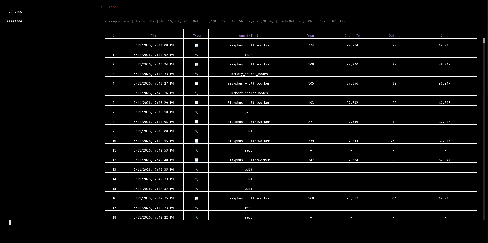
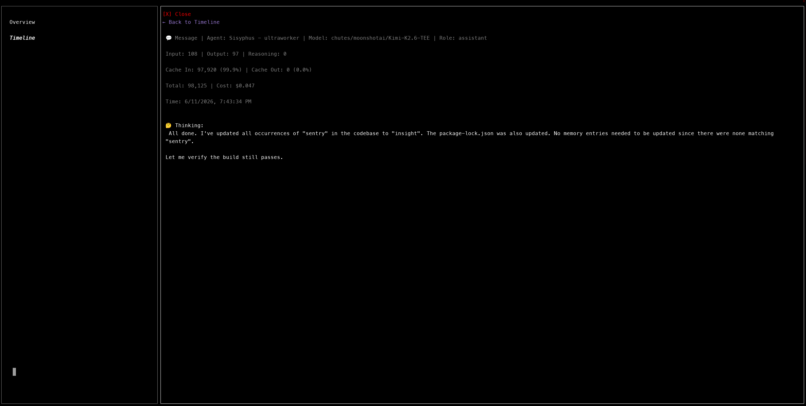

# OpenCode Insight

A monitoring plugin for [OpenCode](https://github.com/anomalyco/opencode) that provides real-time observability into your AI coding sessions.

## Features

- **Overview Dashboard** — Total tokens, costs, and cache rates at a glance
- **Timeline View** — Chronological view of all messages and tool calls with full content
- **Real-time Data** — Live data from your local OpenCode database
- **Token Breakdown** — Detailed metrics: input, output, reasoning, cache in/out with rates
- **Cost Tracking** — Per-message and accumulated cost analysis

## Installation

```json
{
  "plugins": ["opencode-insight"]
}
```

## Usage

The plugin adds a sidebar panel to your OpenCode TUI. Click the monitor icon to open the overlay.

### Views

- **Overview** — Summary cards with total tokens and timeline entries
- **Timeline** — Scrollable list of all messages and tool calls
  - Click any row to see full details including message content
  - Shows: Input tokens, Cache In, Output tokens, Cost

### Screenshots

**Timeline List View**



**Message Detail View**



## Data Reference

See [`docs/DATA-SOURCES.md`](docs/DATA-SOURCES.md) for a complete catalog of all metrics, token fields, message parts, session data, and real-time events available to the plugin.

## Requirements

- OpenCode >= 1.0.0
- Node.js >= 18

## License

MIT
