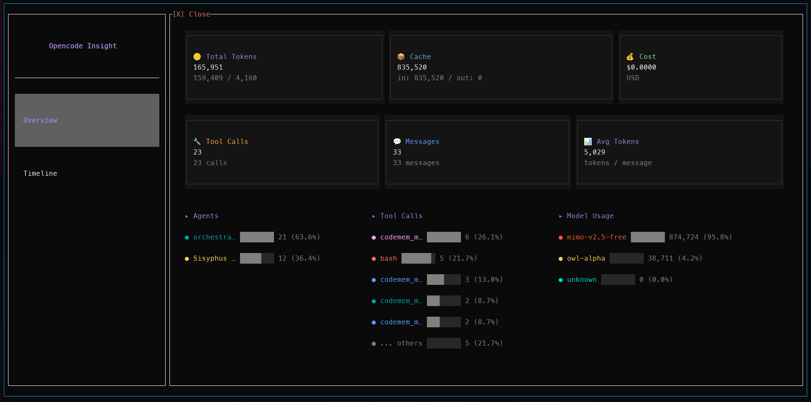

# OpenCode Insight

A monitoring plugin for [OpenCode](https://github.com/anomalyco/opencode) that provides real-time observability into your AI coding sessions.

## Features

- **Overview Dashboard** — 6 metric cards + token distribution + model usage + cache efficiency
- **Timeline View** — Scrollable list of messages and tool calls with inline detail expansion
- **Real-time Updates** — Auto-refreshes every 2 seconds via the official OpenCode API
- **Theme Aware** — Integrates with OpenCode's current theme

## Installation

Add to your `tui.json`:

```json
{
  "plugins": ["opencode-insight"]
}
```

## Usage

Click **"🤖 Opencode Insight"** in the sidebar to open the fullscreen overlay.

### Overview Panel

| Card | Shows |
|------|-------|
| **Total Tokens** | All tokens consumed |
| **Cost** | Total USD |
| **Input** | Input tokens + cached |
| **Output** | Output tokens + cached |
| **Cache** | Cache read + write |
| **Tool Calls** | Total tool call count |

### Timeline Panel

Scrollable table of every message and tool call. Click any row to expand inline details — message content, reasoning, token breakdown, or tool I/O.

## Screenshots



## Troubleshooting

If the plugin doesn't load or shows stale code after reinstalling:

```bash
rm ~/.cache/opencode/packages/opencode-insight@latest -rf
```

Then restart OpenCode.

## Requirements

- OpenCode >= 1.17.3

## License

MIT
